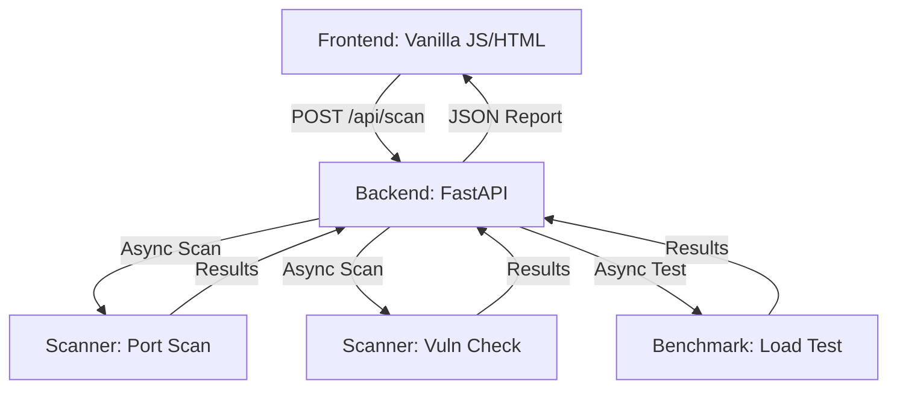

# Localghost - Developer Documentation

> Comprehensive documentation for developers working on Localghost.

**Version:** 0.1.0 | **Last Updated:** 2026-02-23

---

## Table of Contents

- [Architecture Overview](#architecture-overview)
- [Project Structure](#project-structure)
- [Naming Conventions](#naming-conventions)
- [API Reference](#api-reference)
- [Environment Variables](#environment-variables)
- [Security Practices](#security-practices)
- [Error Handling](#error-handling)
- [Testing](#testing)
- [Commands](#commands)
- [Intended Changes](#intended-changes)
- [Project Auditing](#project-auditing--quality-standards)
- [Troubleshooting](#troubleshooting)

---

## Architecture Overview

Localghost is a lightweight pentesting and benchmarking dashboard designed for local development environments. It uses a **FastAPI** backend to orchestrate various security and performance tests asynchronously using `aiohttp` and `asyncio`.



### Key Design Decisions

| Decision | Rationale |
|----------|-----------|
| **FastAPI + Asyncio** | Enables non-blocking execution of multiple scans (ports, vulns, benchmarks) simultaneously. |
| **Vanilla Frontend** | Lowers technical debt and ensures maximum compatibility without build step complexities for a local tool. |
| **Glow Design System** | Provides a modern, premium "hacker" aesthetic that fits the tool's purpose. |

---

## Project Structure

```
localghost/
├── backend/                  # Python/FastAPI Application
│   ├── scanner/              # Core scanning logic
│   │   ├── port_scan.py      # TCP port discovery
│   │   └── vuln_scan.py      # Security header & file checks
│   ├── benchmark/            # Performance testing
│   │   └── load_test.py      # HTTP load generation
│   └── main.py               # API entry point & static mounting
├── frontend/                 # Client-side assets
│   ├── static/               
│   │   ├── style.css         # Glow CSS system
│   │   └── app.js            # Frontend logic & API client
│   └── index.html            # Main dashboard UI
├── README.md                 # User-facing documentation
├── DEVELOPMENT.md            # This file
├── CHANGELOG.md              # Version history
├── LICENSE.md                # License terms
└── pyproject.toml            # Project dependencies (uv)
```

---

## Naming Conventions

### Files & Directories

| Type | Convention | Good Example | Bad Example |
|------|-----------|--------------|-------------|
| **Python Modules** | `snake_case` | `port_scan.py` | `PortScan.py` |
| **Frontend Assets** | `snake_case` / `kebab-case` | `style.css`, `app.js` | `Styles.css` |
| **Components** | `snake_case` | `load_test.py` | `LoadTest` |

---

## API Reference

### Base URL

| Environment | URL |
|-------------|-----|
| Local | `http://localhost:8000` |

### Endpoints

#### Scanning

| Method | Path | Auth | Description |
|--------|------|------|-------------|
| `POST` | `/api/scan` | None | Initiates a multi-stage scan (ports, vulns, benchmarks). |

---

## Environment Variables

> [!CAUTION]
> Never commit `.env` files. Localghost currently uses system defaults, but future integrations (e.g., Slack notifications) will require environment configuration.

---

## Security Practices

### Input Validation & Sanitization

- Target URLs are validated and normalized in `backend/main.py`.
- Pydantic models are used for request body validation.

### Dependency Auditing

```bash
# Check for known vulnerabilities in Python dependencies
uv run pip-audit
```

---

## Error Handling

### Server-Side

- All API routes use `try/catch` blocks returned as standardized `HTTPException` responses.
- Asynchronous tasks use `asyncio.gather` with selective error suppression to ensure one failed scan doesn't crash the entire report.

---

## Testing

### Running Tests

```bash
# Run all tests (WIP)
uv run pytest
```

---

## Commands

### `uv run python backend/main.py`

Starts the Localghost development server.

---

## Intended Changes

### Upcoming

| Change | Impact | Target Version |
|--------|--------|----------------|
| **Docker Support** | Easier deployment for isolated testing. | `0.2.0` |
| **Export Reports** | Generate PDF/JSON security reports. | `0.2.0` |
| **Extended Vuln DB** | Check for more common local misconfigs. | `0.3.0` |

---

## Project Auditing & Quality Standards

Localghost adheres to strict performance and security standards for local tools. Every change must be audited for resource leaks (especially during load tests) and side effects on the target system.

---

## Troubleshooting

### Common Issues

| Issue | Solution |
|-------|----------|
| **CORS Errors** | Ensure the target server allows requests from `localhost:8000`. |
| **Port Scan Timeout** | Increase the timeout in `backend/scanner/port_scan.py` for slow networks. |

---

<p align="center">
  <a href="README.md">← Back to README</a>
</p>
