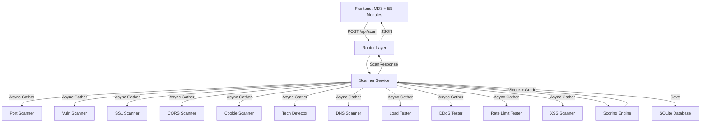

# Localghost - Developer Documentation

> Comprehensive documentation for developers working on Localghost.

**Version:** 0.2.0 | **Last Updated:** 2026-02-24

---

## Table of Contents

- [Architecture Overview](#architecture-overview)
- [Project Structure](#project-structure)
- [Naming Conventions](#naming-conventions)
- [Database Schema](#database-schema)
- [API Reference](#api-reference)
- [Environment Variables](#environment-variables)
- [Security Practices](#security-practices)
- [Error Handling](#error-handling)
- [Testing](#testing)
- [Commands](#commands)
- [Intended Changes](#intended-changes)
- [Project Auditing](#project-auditing--quality-standards)
- [Troubleshooting](#troubleshooting)

---

## Architecture Overview

Localghost follows a **layered service** architecture with a FastAPI backend orchestrating 11 async scanner modules, a scoring engine, and SQLite persistence. The frontend is a vanilla JS dashboard using Material Design 3 tokens.



### Key Design Decisions

| Decision | Rationale |
|----------|-----------|
| **FastAPI + asyncio** | Non-blocking concurrent execution of all 11 scan modules via `asyncio.gather`. |
| **Layered architecture** | Routers → Services → Scanners separation enables testing and swapping individual modules. |
| **Vanilla frontend + ES Modules** | Zero build step, maximum compatibility. ES Modules give proper code organization without bundler complexity. |
| **Material Design 3** | Google's latest design system provides accessible, responsive, and premium UI out of the box. |
| **SQLite via aiosqlite** | Lightweight, zero-config persistence for scan history. No external database needed. |
| **Weighted scoring (0–100)** | Each security category has a proportional weight reflecting its real-world impact. |

---

## Project Structure

```
localghost/
├── backend/                  # Python/FastAPI Application
│   ├── routers/              # API route definitions
│   │   ├── scan.py           # POST /api/scan
│   │   ├── history.py        # GET/DELETE /api/history
│   │   └── report.py         # GET /api/report/:id
│   ├── services/             # Business logic
│   │   ├── scanner.py        # Orchestrates all scan modules
│   │   └── scoring.py        # Security score computation
│   ├── scanners/             # Individual scan modules
│   │   ├── port_scan.py      # TCP port discovery
│   │   ├── vuln_scan.py      # Security headers + sensitive files
│   │   ├── ssl_scan.py       # SSL/TLS analysis
│   │   ├── cors_scan.py      # CORS misconfiguration
│   │   ├── cookie_scan.py    # Cookie security audit
│   │   ├── tech_detect.py    # Technology fingerprinting
│   │   ├── dns_scan.py       # DNS enumeration
│   │   ├── load_test.py      # HTTP load generation
│   │   ├── ddos_test.py      # DDoS resilience testing
│   │   ├── rate_limit_test.py # API rate limit detection
│   │   └── xss_scan.py       # Reflected XSS scanning
│   ├── models/               # Pydantic schemas
│   │   └── scan.py           # Request/response models
│   ├── database/             # Persistence layer
│   │   └── db.py             # SQLite CRUD operations
│   ├── utils/                # Shared utilities
│   │   └── validators.py     # URL validation + sanitization
│   └── main.py               # App factory + startup
├── frontend/                 # Client-side
│   ├── static/
│   │   ├── js/               # ES Modules
│   │   │   ├── app.js        # Entry point
│   │   │   ├── api.js        # Fetch wrappers
│   │   │   ├── results.js    # Result rendering
│   │   │   ├── score.js      # Score gauge SVG
│   │   │   ├── history.js    # History sidebar
│   │   │   ├── theme.js      # Dark/light toggle
│   │   │   └── utils.js      # DOM helpers
│   │   └── style.css         # MD3 design tokens
│   └── index.html            # Dashboard
├── README.md                 # User-facing docs
├── DEVELOPMENT.md            # This file
├── CHANGELOG.md              # Version history
├── LICENSE.md                # License terms
└── pyproject.toml            # Dependencies (uv)
```

---

## Naming Conventions

### Files & Directories

| Type | Convention | Good Example | Bad Example |
|------|-----------|--------------|-------------|
| **Python Modules** | `snake_case` | `port_scan.py` | `PortScan.py` |
| **Frontend JS** | `snake_case` | `app.js`, `utils.js` | `App.js` |
| **CSS Files** | `kebab-case` | `style.css` | `Styles.css` |

### Functions & Methods

| Prefix | Purpose | Example |
|--------|---------|---------|
| `scan_` / `check_` | Scanner functions | `scan_ports()`, `check_vulnerabilities()` |
| `get_` / `save_` | Database CRUD | `get_scan()`, `save_scan()` |
| `render_` | Frontend rendering | `renderResults()`, `renderScoreGauge()` |
| `compute_` | Business logic | `compute_score()` |
| `validate_` | Input validation | `validate_target_url()` |
| `init_` | Initialization | `initTheme()`, `initSidebar()` |

---

## Database Schema

### Models Overview (1 total)

| Model | Purpose | Key Fields |
|-------|---------|------------|
| **scans** | Stores scan results and scores | `scan_id`, `target_url`, `timestamp`, `score`, `grade`, `results_json` |

### Schema

```sql
CREATE TABLE scans (
    scan_id     TEXT PRIMARY KEY,
    target_url  TEXT NOT NULL,
    timestamp   TEXT NOT NULL,
    score       INTEGER DEFAULT 0,
    grade       TEXT DEFAULT 'F',
    results_json TEXT NOT NULL
);

CREATE INDEX idx_scans_timestamp ON scans(timestamp DESC);
```

---

## API Reference

### Base URL

| Environment | URL |
|-------------|-----|
| Local | `http://localhost:13666` |

### Request / Response Format

| Detail | Value |
|--------|-------|
| **Content-Type** | `application/json` |
| **Date format** | ISO 8601 (`YYYY-MM-DDTHH:mm:ssZ`) |

### Error Responses

```json
{
  "detail": "Error message describing what went wrong"
}
```

| Status | When |
|--------|------|
| `400` | Invalid target URL or request body |
| `404` | Scan not found in history |
| `500` | Unexpected server failure |

### Endpoints

#### Scanning

| Method | Path | Auth | Description |
|--------|------|------|-------------|
| `POST` | `/api/scan` | None | Execute a multi-module security scan. |

**Request Body:**
```json
{
  "target_url": "http://127.0.0.1:3000",
  "modules": {
    "port_scan": true,
    "vuln_scan": true,
    "ssl_scan": true,
    "cors_scan": true,
    "cookie_scan": true,
    "tech_detect": true,
    "dns_scan": true,
    "load_test": false,
    "ddos_test": false,
    "rate_limit_test": false,
    "xss_scan": false
  },
  "benchmark_config": {
    "concurrency": 50,
    "duration_seconds": 5
  }
}
```

#### History

| Method | Path | Auth | Description |
|--------|------|------|-------------|
| `GET` | `/api/history` | None | List past scans (paginated, `?limit=50&offset=0`). |
| `GET` | `/api/history/{scan_id}` | None | Get a specific scan result. |
| `DELETE` | `/api/history/{scan_id}` | None | Delete a scan entry. |
| `DELETE` | `/api/history` | None | Clear all history. |

#### Report

| Method | Path | Auth | Description |
|--------|------|------|-------------|
| `GET` | `/api/report/{scan_id}` | None | Download scan report as JSON file. |

#### Health

| Method | Path | Auth | Description |
|--------|------|------|-------------|
| `GET` | `/health` | None | Health check endpoint. |

---

## Environment Variables

> [!CAUTION]
> Never commit `.env` files. Localghost currently uses system defaults, but future integrations (e.g., Slack notifications) will require environment configuration.

No environment variables are required for local operation.

---

## Security Practices

### Input Validation & Sanitization

- All target URLs are validated and normalized in `backend/utils/validators.py`.
- Pydantic models enforce type safety and constraints on all API inputs.
- URL length capped at 2048 characters.

### Dependency Auditing

```bash
# Check for known vulnerabilities in Python dependencies
uv run pip-audit
```

---

## Error Handling

### Server-Side

| Layer | Strategy |
|-------|----------|
| **Route handlers** | `try/catch` with `HTTPException` responses (400/404/500). |
| **Scanner modules** | Individual scanner failures are caught and don't crash the entire scan. |
| **Database** | DB save failures are silently caught — scan results still return to the user. |
| **Orchestrator** | `asyncio.gather` with `return_exceptions=True` isolates module failures. |

### Client-Side

| Layer | Strategy |
|-------|----------|
| **API calls** | Centralized `api.js` with error extraction from response body. |
| **Scan form** | Error messages logged to TUI terminal panel. |

---

## Testing

### Running Tests

```bash
# All tests (WIP)
uv run pytest
```

---

## Commands

### `uv run python -m backend.main`

Starts the Localghost development server on `http://127.0.0.1:13666`. Includes auto-reload.

---

## Intended Changes

---

## Project Auditing & Quality Standards

> A structured approach to ensuring the project is correct, secure, and maintainable.

### Audit Categories

| Category | Focus Areas |
|----------|-------------|
| **Correctness** | Logical errors, edge-case failures, silent failures, data integrity |
| **Security** | Vulnerabilities, input weaknesses, sensitive data exposure |
| **Performance** | Scanner efficiency, connection limits, resource usage |
| **Architecture** | Layer separation, module coupling, scalability |
| **Maintainability** | Readability, naming consistency, technical debt |
| **Documentation** | Accuracy, completeness, implementation-spec matching |

### Reporting Process

- All findings must be added to [TASKS.md](TASKS.md).
- Entries must be **Clear**, **Actionable**, and **Concisely described**.

---

## Troubleshooting

### Common Issues

| Issue | Solution |
|-------|----------|
| **CORS Errors** | Ensure the target server allows requests from `localhost:13666`. |
| **Port Scan Timeout** | Increase the timeout in `backend/scanners/port_scan.py` (default: 0.5s). |
| **aiosqlite not found** | Run `uv sync` to install new dependencies. |
| **Module not found** | Run from the `localghost/localghost/` directory, not the repo root. |

---

<p align="center">
  <a href="README.md">← Back to README</a>
</p>
